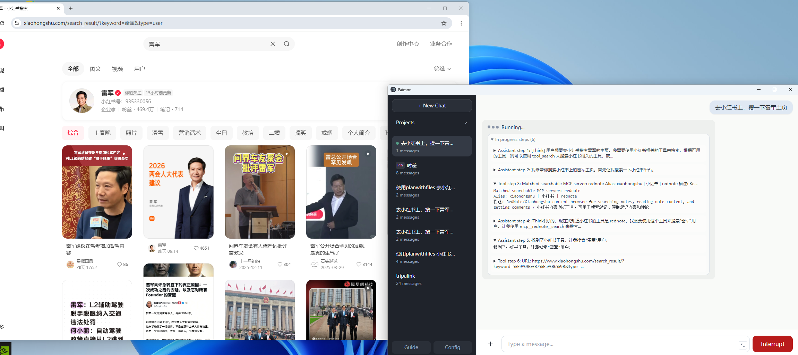
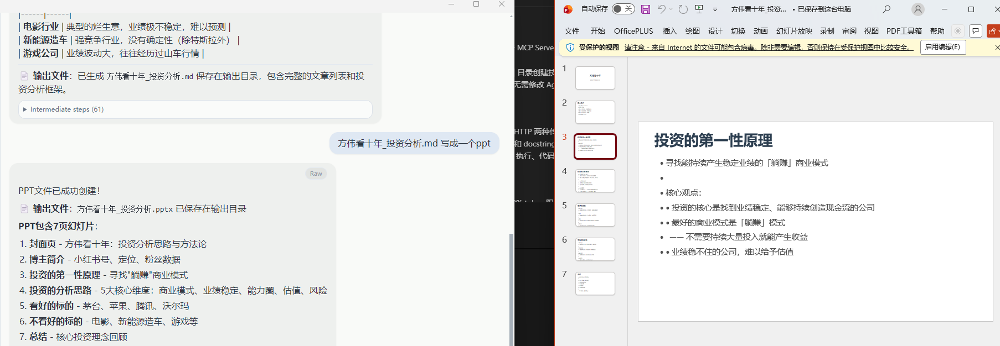
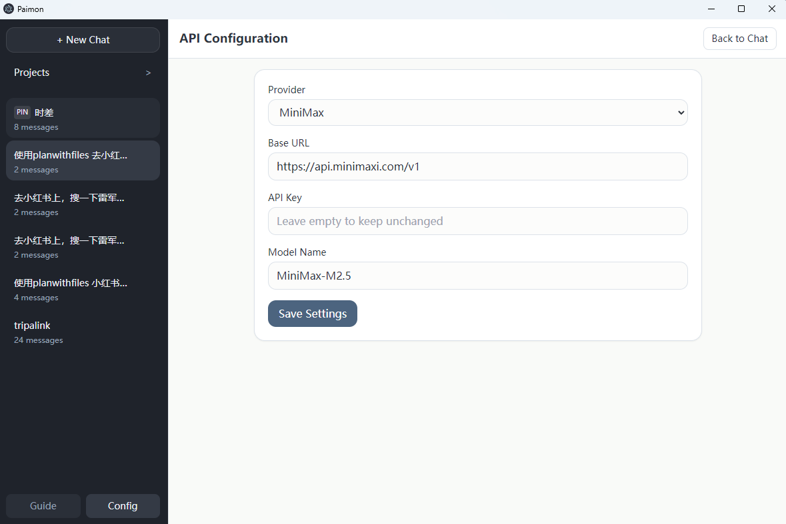
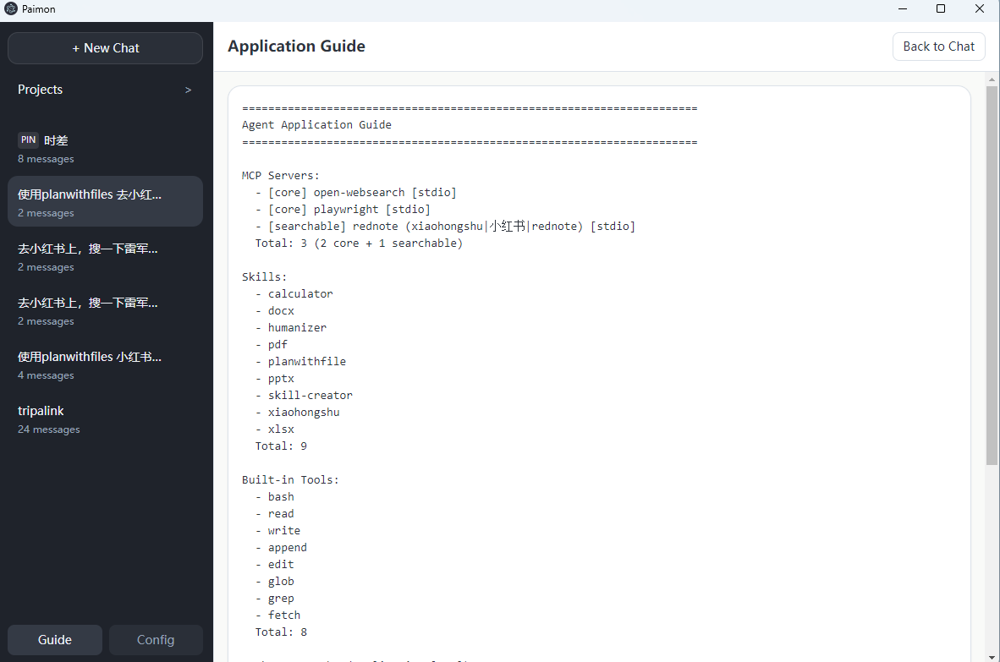
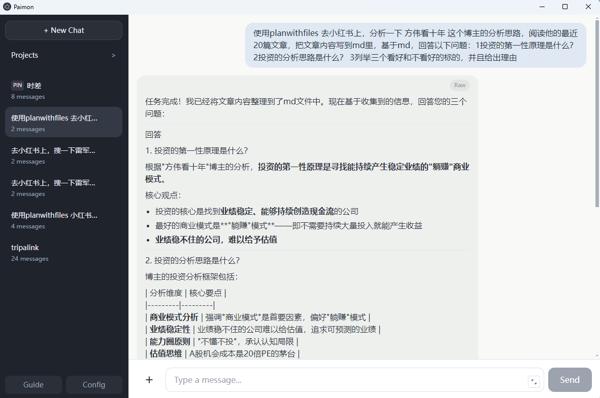
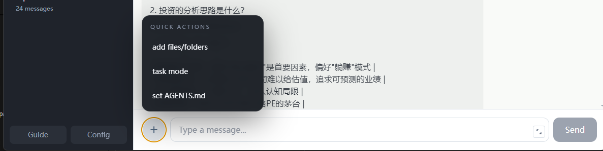

# Paimon：AI 桌面助手

[Jump to English Version](#english-version)

Paimon 是一款面向非技术用户的 AI 桌面助手，参考 Claude Code 的 Agent 工作流与核心能力模型，把原本偏工程化的能力做成零门槛交互产品。

---

## 中文版

<a id="cn-toc"></a>

### 快速导航

- [1. 介绍定位](#cn-1)
- [2. 部分功能展示](#cn-2)
- [3. Config 和 Guide 模块](#cn-3)
- [4. 前端设计与交互](#cn-4)
- [5. Agent 运行逻辑](#cn-5)
- [6. 沙盒安全机制](#cn-6)
- [7. 前后端技术实现](#cn-7)
- [8. Git clone 后如何使用](#cn-8)

---

<a id="cn-1"></a>

### 1. 介绍定位

Paimon 的产品定位是：

- 一个可以直接在桌面使用的 AI Agent
- 对非技术用户友好，不需要理解复杂命令体系
- 能把“对话”转成“可执行任务”

核心能力包括：

- 文件操作：创建、读取、修改、删除、批量导入导出
- Bash 运行：在受控范围内执行命令，完成自动化任务
- 上下文管理：长任务自动压缩上下文，减少“聊着聊着忘了前文”
- ReAct（Reasoning + Acting）任务闭环：先思考拆解，再调用工具执行，再基于结果继续决策
- `AGENTS.md` 约束：可注入团队规则，统一 Agent 的执行边界
- Skill + MCP 通用配置：能力可扩展，不依赖硬编码某个特定插件

产品价值是：

- 你可以把它理解为一款可落地执行的 AI 桌面 Agent 产品，而不是只会回答问题的聊天机器人。

---

<a id="cn-2"></a>

### 2. 部分功能展示

#### A. 文件处理

一句话价值：让 AI 直接参与“文件生产和管理流程”，从输入到产出闭环。

- 可以创建、修改、补充文本和代码文件
- 可在会话或项目空间内做结构化文件操作


- 可上传文件/文件夹作为任务输入
- 可下载 AI 生成的文件/文件夹（包括打包下载）


#### B. 浏览器自动化与外部知识库

一句话价值：把社交媒体和网页实时内容接入任务流，扩展 AI 的“可观察世界”。

- 内置浏览器自动化能力，可完成登录与页面操作
- 可连接 X、小红书等平台，把外部内容纳入任务上下文
- 适合做舆情追踪、内容研究、素材采集



#### C. Office 文档生产

一句话价值：让 AI 直接交付业务常用文档，不止输出纯文本。

- 可生成和处理 PPT、DOCX、XLSX 等文档
- 适合方案草稿、汇报材料、结构化数据整理



---

<a id="cn-3"></a>

### 3. Config 和 Guide 模块

一句话价值：配置透明，能力透明，路径透明。

#### Config

- 配置模型供应商（OpenAI / MiniMax / Zhipu / Kimi）
- 配置 Base URL、API Key、模型名
- 适配不同企业或个人的模型接入策略



#### Guide

- 查看当前工作路径和运行目录
- 查看已加载 MCP、已发现 Skills、内置工具
- 帮助团队快速理解“当前这台应用到底能做什么”



---

<a id="cn-4"></a>

### 4. 前端设计与交互

一句话价值：把复杂 Agent 行为压缩成直观、可控、可中断的桌面体验。

布局结构：

- 左侧：项目与会话列表（支持新建、切换、重命名、删除）
- 中部：对话主区（最终回答 + 中间步骤）
- 底部：输入区（支持普通输入和 Slash 选项）
- 弹层：权限确认、文件管理、删除确认

交互亮点：

- 发送后可一键 Interrupt（中断）
- 中断后可 Resume（恢复）
- 草稿按会话缓存，降低误操作成本
- Slash 可快速选择 Skill 和权限模式
- 文件管理弹层支持上传/导入/下载的一站式操作





---

<a id="cn-5"></a>

### 5. Agent 运行逻辑

#### 5.1 AI 上下文由什么组成

每轮模型调用的上下文主要由以下部分构成：

- System Prompt（系统规则）
- `AGENTS.md`（项目/团队执行约束）
- 历史消息（用户、助手、工具结果）
- 当前可用工具定义（MCP + Skills + 内置工具）

#### 5.2 ReAct 机制（Reasoning + Acting）

Paimon 的执行遵循 ReAct 闭环：

- 思考（Reasoning）：先把目标拆成可执行步骤
- 行动（Acting）：按步骤调用工具（文件、命令、MCP、Skill）
- 观察（Observation）：读取工具返回结果和环境反馈
- 继续思考：基于新信息决定下一步，直到任务完成

这个机制的价值是：不是“一次性回答”，而是“边执行边修正”的任务推进。

#### 5.3 工具、Skill、MCP 如何加载

整体是通用加载机制，不绑定某个特定插件：

- MCP：按 `mcp-servers/` 和 `registry.json` 发现与分类（core/searchable）
- Skills：从 `skills/` 自动发现 `SKILL.md`
- 内置工具：`bash/read/write/append/edit/glob/grep/fetch`

其中 searchable MCP 通过 `tool_search` 按需激活，减少无效工具开销。

#### 5.4 上下文如何压缩

当历史接近上下文预算阈值时：

- 系统会保留最近若干轮完整对话
- 将更早历史压缩为结构化摘要
- 继续保持任务连贯性，同时降低 token 压力

#### 5.5 内置工具有哪些

- `bash`
- `read`
- `write`
- `append`
- `edit`
- `glob`
- `grep`
- `fetch`

#### 5.6 React 侧实现（新增）

前端并不是“发完请求就等结果”，而是一个有状态的任务控制器：

- 发送消息时，React 先写入 optimistic message，保证界面即时反馈
- 通过 `AbortController` 管理请求，可安全中断进行中的会话
- 若后端返回 `permission_required`，前端弹权限决策框
- 用户确认后调用权限接口，再以 `resume=true` 继续原任务
- 最后统一刷新会话消息和会话列表，保持 UI 与数据库状态一致

---

<a id="cn-6"></a>

### 6. 沙盒安全机制

一句话价值：让 Agent 可执行，但不失控。

核心策略：

- 路径白名单：写入只能发生在允许的工作区范围
- 越界拦截：写/删操作指向工作区外路径会被拒绝
- 删除确认：删除类行为默认要求确认
- 敏感目录保护：对运行时关键目录（如 Node/Python runtime）做额外防护
- 权限模式：支持 `ask` / `auto`，且可按会话设置

对产品落地的意义：

- 在保证自动化效率的同时，降低误删、误写、误执行风险。

---

<a id="cn-7"></a>

### 7. 前端和后端技术实现

#### 前端

- Electron（桌面容器）
- React + Vite（界面与构建）
- Zustand（状态管理）
- Axios（API 通信）

#### 后端

- FastAPI（服务层）
- Agent Core（任务编排、工具调用、上下文管理）
- SQLite（会话和消息持久化）
- MCP Manager（外部能力接入）
- Permission Manager（权限控制）

#### 运行与数据

- 会话工作区：输入、输出、临时目录隔离
- 项目工作区：项目级文件与会话绑定
- 日志：运行日志按路径统一管理

---

<a id="cn-8"></a>

### 8. Git clone 之后如何使用这个应用

下面给两种路径：开发模式（快速体验）和打包模式（生成安装包）。

#### 路径 A：开发模式（推荐先跑通）

1. 克隆仓库并进入目录

```bash
git clone <your-repo-url>
cd paimon-desk-assistant
```

2. 安装 Python 依赖（建议用独立虚拟环境）

```bash
python -m pip install -r requirements-runtime.txt
```

3. 安装前端依赖并启动 Electron 开发模式

```bash
cd frontend
npm install
npm run electron:dev
```

4. Windows 建议显式指定 Python 解释器（可选但推荐）

```powershell
$env:SKILLS_MCP_PYTHON = (python -c "import sys; print(sys.executable)")
python -c "import fastapi,uvicorn,openai,yaml,fastmcp,tiktoken,send2trash; print('python deps ok')"
```

5. 首次进入应用后，在 Setup/Config 页面完成模型配置

- Provider
- Base URL
- API Key
- Model Name

#### 路径 B：打包模式（生成 EXE）

本项目已提供完整打包说明，请直接参考：

- `packinstr.md`

建议按文档顺序执行：

- 准备 runtime
- 验证 runtime
- 构建前后端
- 生成 x64/arm64 安装包

---

## English

<a id="english-version"></a>

### Quick Navigation

- [1. Positioning](#en-1)
- [2. Feature Highlights](#en-2)
- [3. Config and Guide](#en-3)
- [4. Frontend Design and Interaction](#en-4)
- [5. Agent Runtime Logic](#en-5)
- [6. Sandbox and Safety](#en-6)
- [7. Frontend and Backend Stack](#en-7)
- [8. How to Use After Git Clone](#en-8)

---

<a id="en-1"></a>

### 1. Positioning

Paimon is an AI desktop assistant designed for non-technical users.
It is inspired by the Agent workflow and capability model of Claude Code, but focuses on low-friction product interaction.

Core capabilities:

- File operations
- Controlled Bash execution
- Context lifecycle management
- ReAct (Reasoning + Acting) loop: decompose tasks, act with tools, observe outputs, and iterate
- `AGENTS.md`-based behavioral constraints
- Generic Skill + MCP configuration and loading

---

<a id="en-2"></a>

### 2. Feature Highlights

#### A. File Processing

Business value: turn AI output into real file workflows.

- Create, read, and modify files


- Upload files/folders and download generated outputs


#### B. Browser Automation as External Knowledge Access

Business value: connect social/web platforms to live task context.

- Browser automation for real websites (for example X and RedNote)
- Use social platforms as external knowledge sources


#### C. Office Document Generation

Business value: deliver business-ready files, not only chat text.

- Generate and process PPT, DOCX, and XLSX documents


---

<a id="en-3"></a>

### 3. Config and Guide

#### Config

- Configure provider, base URL, API key, and model name


#### Guide

- Inspect runtime paths, MCP servers, discovered skills, and built-in tools


---

<a id="en-4"></a>

### 4. Frontend Design and Interaction

Layout:

- Left: projects and sessions
- Center: conversation and intermediate steps
- Bottom: composer and slash options
- Dialogs: permissions, file manager, destructive-action confirmations

Interaction highlights:

- Interrupt and resume
- Session draft persistence
- Slash-based skill and permission shortcuts
- Unified file manager for upload/import/download


---

<a id="en-5"></a>

### 5. Agent Runtime Logic

#### 5.1 Context Composition

Each model round is built from:

- System prompt
- `AGENTS.md` constraints
- Message history (user, assistant, tool results)
- Active tool schemas

#### 5.2 ReAct Loop (Reasoning + Acting)

Paimon follows a ReAct runtime loop:

- Reasoning: break goals into executable steps
- Acting: call tools (files, commands, MCP, skills)
- Observation: read tool outputs and environment feedback
- Next-step reasoning: decide what to do next until completion

This makes execution adaptive and iterative, instead of producing a one-shot static answer.

#### 5.3 Tool/Skill/MCP Loading

A generic loading pipeline is used:

- MCP discovery via `mcp-servers/` + `registry.json`
- Skill discovery via `skills/**/SKILL.md`
- Built-in tools (`bash/read/write/append/edit/glob/grep/fetch`)

Searchable MCPs can be activated on demand via `tool_search`.

#### 5.4 Context Compression

When history reaches the context budget threshold:

- Keep recent rounds intact
- Compress older rounds into structured summaries
- Preserve continuity while reducing token pressure

#### 5.5 Built-in Tools

- `bash`
- `read`
- `write`
- `append`
- `edit`
- `glob`
- `grep`
- `fetch`

#### 5.6 React-side Runtime Control (added)

The React app acts as a stateful runtime controller, not a passive UI:

- Writes optimistic messages for instant feedback
- Uses `AbortController` for safe interruption
- Handles `permission_required` responses with a decision modal
- Confirms permissions, then resumes with `resume=true`
- Refreshes messages and session metadata for state consistency

---

<a id="en-6"></a>

### 6. Sandbox and Safety

Safety principles:

- Writable path boundaries
- Out-of-scope write/delete blocking
- Confirmation gates for destructive actions
- Extra protection for sensitive runtime roots
- Session-level permission modes (`ask` / `auto`)

---

<a id="en-7"></a>

### 7. Frontend and Backend Stack

Frontend:

- Electron
- React + Vite
- Zustand
- Axios

Backend:

- FastAPI
- Agent Core
- SQLite
- MCP Manager
- Permission Manager
- Context Manager

Runtime model:

- Session/project scoped workspaces
- Persistent message storage
- Structured runtime logs

---

<a id="en-8"></a>

### 8. How to Use After Git Clone

#### Path A: Development Mode

```bash
git clone <your-repo-url>
cd paimon-desk-assistant
python -m pip install -r requirements-runtime.txt
cd frontend
npm install
npm run electron:dev
```

Optional on Windows:

```powershell
$env:SKILLS_MCP_PYTHON = (python -c "import sys; print(sys.executable)")
```

Then complete model setup in the app (Provider, Base URL, API Key, Model).

#### Path B: Packaging Mode

Use the existing packaging guide:

- `packinstr.md`

Follow its sequence to prepare runtimes, verify assets, build, and generate installers.
