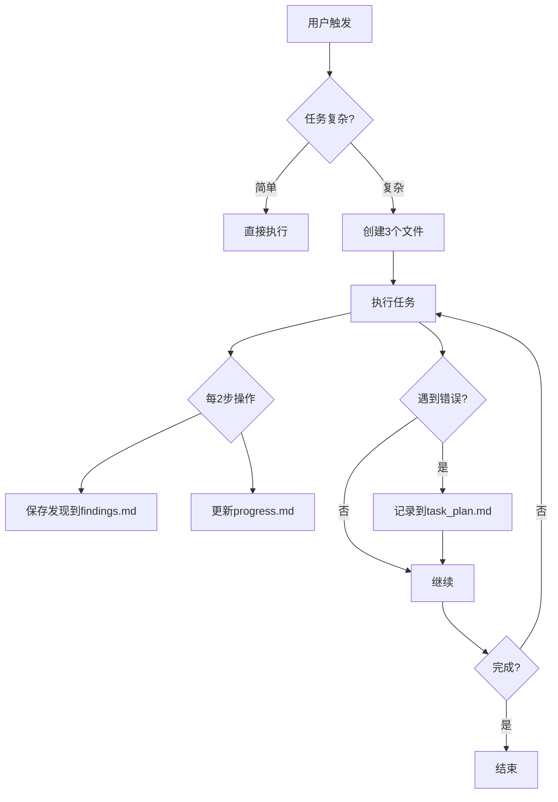

# Plan With File - 持久化规划系统

## 核心理念

```
上下文窗口 = RAM (易失、有限)
文件系统 = 磁盘 (持久、无限)

→ 任何重要信息都写入磁盘
```

## 何时使用

**使用此模式：**
- 多步骤任务 (3+ 步骤)
- 研究任务
- 构建项目
- 跨大量工具调用的任务

**跳过：**
- 简单问题
- 单文件编辑
- 快速查询

## 三文件模式

每个复杂任务创建三个文件：

```
task_plan.md    → 跟踪阶段和进度
findings.md     → 存储研究和发现
progress.md     → 会话日志和测试结果
```

## 工作流程

### 1. 启动规划会话

当用户触发此 skill 时：

```markdown
# 第一步：获取任务描述

如果用户没有提供任务描述，询问：
"请描述您需要完成的任务"

# 第二步：创建三个文件

创建任务规划文件：
- task_plan.md    → 计划与进度
- findings.md     → 研究发现
- progress.md     → 会话日志
```

### 2. task_plan.md 模板

```markdown
# 任务计划

## 目标
[用户任务描述]

## 阶段

### 阶段 1: [名称]
- [ ] 步骤 1.1
- [ ] 步骤 1.2
- [ ] 步骤 1.3

### 阶段 2: [名称]
- [ ] 步骤 2.1
- [ ] 步骤 2.2

### 阶段 3: [名称]
- [ ] 步骤 3.1
- [ ] 步骤 3.2

## 错误日志
*记录所有失败和尝试，避免重复*

## 状态
当前阶段: 阶段 1
当前步骤: 步骤 1.1
```

### 3. findings.md 模板

```markdown
# 研究发现

## 架构/结构
*记录代码库结构、关键文件*

## 技术细节
*记录重要技术信息、依赖、配置*

## 问题与解决方案
*记录遇到的问题和解决方法*

## 参考资源
*记录有用的链接、文档*
```

### 4. progress.md 模板

```markdown
# 进度日志

## 会话 1 - [日期]
### 操作
- [时间] 创建规划文件
- [时间] 分析代码结构

### 结果
- 完成: ...

### 下一步
- ...
```

## 关键规则

### 1. 先创建计划
永远不要在没有 `task_plan.md` 的情况下开始复杂任务。

### 2. 两动作规则
每 2 个查看/浏览操作后，保存发现到 `findings.md`。

### 3. 记录所有错误
在 `task_plan.md` 的错误日志中记录失败，帮助避免重复。

### 4. 定期重读计划
在重大决策前，重新读取 `task_plan.md` 确保方向正确。

### 5. 更新 checkbox
完成步骤后，更新 `[ ]` 为 `[x]`。

## Manus 原则

| 原则 | 实现 |
|------|------|
| 文件系统即记忆 | 存储到文件而非上下文 |
| 注意力管理 | 决策前重读计划 |
| 错误持久化 | 在计划文件中记录失败 |
| 目标跟踪 | 用 checkbox 显示进度 |
| 完成验证 | 停止前检查所有阶段 |

## 执行模式



## 快捷命令

用户可以通过以下方式触发：

1. 描述复杂任务时自动建议使用此模式
2. 用户明确说 "用规划模式" 或 "plan with file"

## 示例

### 用户输入
"帮我构建一个 React Todo 应用"

### 响应
```markdown
这是一个复杂任务，让我用规划模式来处理。

[创建 task_plan.md, findings.md, progress.md]

开始执行...
```
